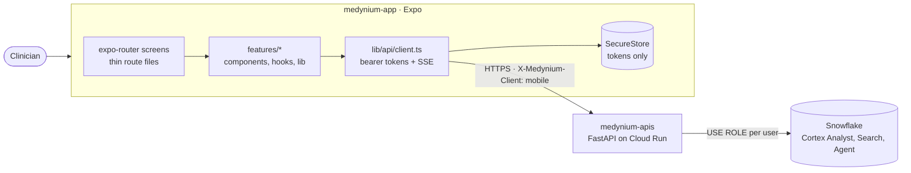
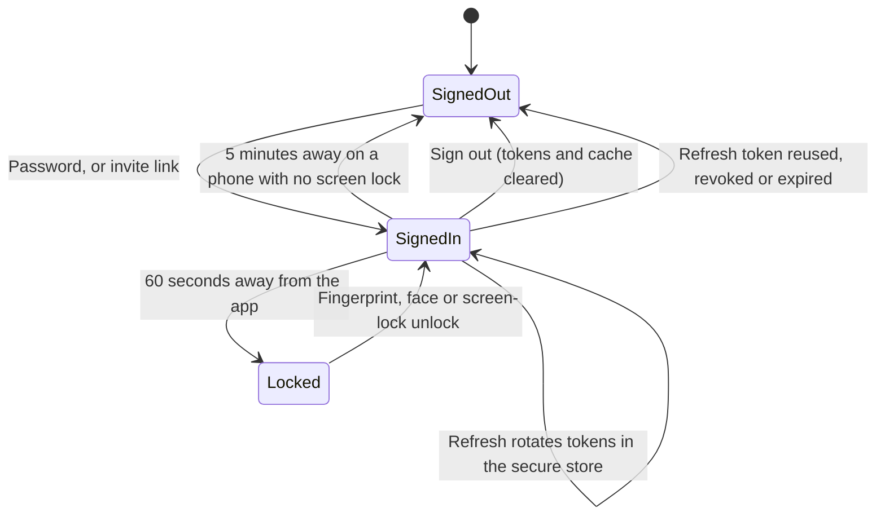
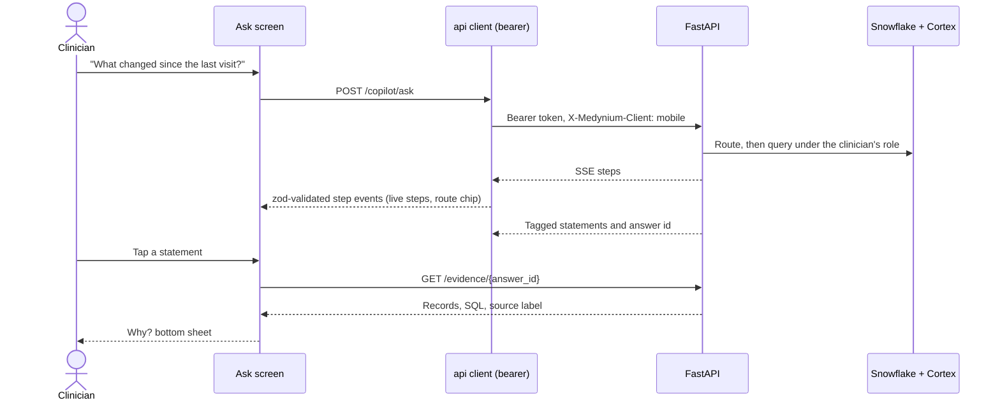

<div align="center">

<!-- MEDIA: banner. Suggested file: docs/media/banner.png (1600x400) -->


# Medynium Mobile

### Patient 360 and an evidence-first assistant, in the clinician's pocket.

The same governed Patient 360 as the web workstation, rebuilt for a phone: a tap on any statement shows the evidence behind it.


**[Web workstation](../medynium-ui)** · **[API](../medynium-apis)**

</div>

> **Synthetic data only. Decision support, not diagnosis.** Built for the Snowflake CoCo CLI Hackathon 2026.

---

## Table of contents

1. [Why a mobile app](#why-a-mobile-app)
2. [See it in action](#see-it-in-action)
3. [Impact](#impact)
4. [Features](#features)
5. [Privacy and security on the device](#privacy-and-security-on-the-device)
6. [Architecture](#architecture)
7. [Tech stack](#tech-stack)
8. [Run it](#run-it)
9. [Daily commands](#daily-commands)
10. [Project structure](#project-structure)
11. [Build status and honest limits](#build-status-and-honest-limits)
12. [The Medynium repositories](#the-medynium-repositories)

Also see the workspace [README](../README.md), the [evaluation hub](../medynium-apis/docs/evaluation/README.md) and the [diagram gallery](../medynium-apis/docs/architecture/diagrams.md).

---

## Why a mobile app

Clinical decisions happen at the bedside, in corridors and between consults, not only at a desk. Medynium Mobile puts the pre-consult review, the evidence panel and the assistant on the device a clinician already carries, so "what changed, and is it a concern?" is a thumb away. It reuses the same API, access rules and audit trail as the web, so nothing about trust is weakened on the smaller screen.

---

## See it in action

<!-- MEDIA: phone demo. Suggested: docs/media/demo.gif (about 20 s) -->
<p align="center">
  
</p>

|                   |                                                      |
| ----------------- | ---------------------------------------------------- |
| **Demo video**    | _Add the video link here_                            |
| **Android build** | _Add the APK or EAS link here_                       |
| **Deployed API**  | Cloud Run, set in `eas.json` for every build profile |

<!-- MEDIA: screenshots. Add these files under docs/media/ (portrait, about 1080x2400) -->

|      |  |  |              |
| :------------------------------: | :--------------------------------: | :------------------------------------: | :------------------------------------: |
| **Home.** Worklist and attention |  **Patient 360.** Segmented tabs   |   **Why? sheet.** Evidence on a tap    | **Ask.** Live steps and tagged answers |

---

## Impact

- **Point-of-care context.** Pre-consult review, lab trends and the safety review are available wherever the clinician is.
- **Evidence on a tap.** There is no hover on a phone, so every tagged statement opens a Why? bottom sheet with the records and source behind it.
- **Same governance everywhere.** Access is decided by Snowflake under the user's own role. The app cannot show a patient the user may not open, and a denied patient looks exactly like a missing one.
- **Safe on a lost or shared phone.** Patient data is never stored on the device, backups are disabled, and the app locks itself.

### Real-world use cases

| Use case                              | On the phone                    | Why it helps                                                          |
| ------------------------------------- | ------------------------------- | --------------------------------------------------------------------- |
| **Ward rounds and corridor consults** | Home worklist, Patient 360 tabs | Context where the clinician already is                                |
| **Quick medicine check**              | Safety tab, Ask                 | The lab trend tied to the label section; Why? opens as a bottom sheet |
| **Follow-up on the move**             | Pending tab                     | Open findings, due follow-ups, abnormal labs, recent ER visits        |
| **Photographing a report**            | Reports                         | Rows extracted with their quoted words; a doctor approves each        |
| **A lost or shared phone**            | Auto-lock, secure store         | No clinical data at rest, no backups, locks after 60 seconds away     |

No user study has been run; see [impact and use cases](../medynium-apis/docs/evaluation/impact-and-use-cases.md) for what is and is not claimed.

---

## Features

| Area                  | What you get                                                                                                                                 |
| --------------------- | -------------------------------------------------------------------------------------------------------------------------------------------- |
| **Sign in**           | Password, optional emailed code, invitation links; session tokens held in the secure store                                                   |
| **Home**              | Dashboard tiles, the worklist with change flags and a "Needs attention" panel                                                                |
| **Patients**          | Search, filters, and the patient workspace                                                                                                   |
| **Patient workspace** | Segmented tabs: Overview, Timeline, Medications, Labs (trend chart), Claims, Notes, Safety, Reports, Similar; allergies always visible       |
| **Clinical brief**    | Attention, what changed (previous visit, 90 days, 1 year) and missing information on the Overview, each line opening the record it came from |
| **Why? evidence**     | A bottom sheet from any tagged statement: records, SQL and the source label                                                                  |
| **Ask (assistant)**   | Plain-language questions with live steps, route chip, refusals and proposals the doctor approves                                             |
| **Pending**           | Open findings, follow-ups, unreviewed abnormal labs and recent emergency visits in one list                                                  |
| **Reports**           | Upload a report, review each extracted row and approve; doctors decide                                                                       |
| **Knowledge**         | Drug-label search with full citations                                                                                                        |
| **Activity**          | Your own audit log                                                                                                                           |
| **You**               | Account, theme choice, auto-lock settings, saved views, email summary                                                                        |
| **Admin**             | Health, users, password reset links and invitations. Per-user patient access stays on the web                                                |
| **Documentation**     | In-app guide to how the assistant and evidence work                                                                                          |

Navigation: bottom bar of Home, Patients, Pending, Ask and More; the patient workspace opens above Patients.

Design: the web workstation's tokens, Roboto headings and Inter body, press feedback on every control, staggered list entrances, spring bottom sheets that follow a drag, and typing dots while the assistant works. All motion honours the system reduce-motion setting.

---

## Privacy and security on the device

| Control                      | How                                                                                                                                               |
| ---------------------------- | ------------------------------------------------------------------------------------------------------------------------------------------------- |
| **No clinical data at rest** | Tokens live in the secure store only. No query-cache persistence and no local storage of patient data; the in-memory cache is cleared on sign-out |
| **No Android backups**       | `allowBackup=false` via a config plugin, so patient data cannot reach cloud backups                                                               |
| **Auto-lock**                | Biometric or screen-lock unlock after inactivity                                                                                                  |
| **HTTPS only in release**    | Release and production builds refuse plain HTTP; cleartext is allowed only in the development profile                                             |
| **No secrets in the bundle** | Only `EXPO_PUBLIC_*` values are bundled; the API holds every credential                                                                           |
| **Synthetic-data banner**    | On every screen that shows patient data                                                                                                           |

---

## Architecture



### Session and lock



### How an answer reaches the phone



The app never talks to Snowflake. It reaches the same API as the web, in bearer-token mode (`POST /auth/mobile/refresh`), and stream and answer payloads are validated with zod at the boundary.

Types flow from the API exactly as in the web: `medynium-apis` writes `docs/api/openapi.json`, and `npm run api:types` generates `src/lib/api/schema.d.ts`. Never edit that file by hand.

---

## Tech stack

| Area      | Choice                                                                               |
| --------- | ------------------------------------------------------------------------------------ |
| Framework | Expo SDK 57, React Native 0.86, React 19, expo-router (typed routes), React Compiler |
| Language  | TypeScript (strict)                                                                  |
| Data      | TanStack Query (in-memory only), zod, `openapi-typescript` generated types           |
| Storage   | `expo-secure-store` for tokens                                                       |
| Quality   | ESLint, Prettier, Jest with test-renderer, contrast checker                          |
| Build     | EAS Build (development, preview, release and production profiles)                    |

---

## Run it

1. API: in `medynium-apis`, run `poe start` (listens on all interfaces; allow port 8000 through the Windows firewall for private networks).
2. `cp .env.example .env` and set `EXPO_PUBLIC_API_URL` to `http://<your PC LAN IP>:8000` (phone and PC on the same Wi-Fi).
3. `npm install`, then build the dev client once: `npx eas-cli build --profile development --platform android` and install the APK.
4. `npm start`, open the dev client and scan the QR code.

The deployed API is `https://medynium-api-uujbhqhgzq-el.a.run.app` (Cloud Run); `eas.json` sets it for every build profile. To use a local API instead, set `EXPO_PUBLIC_API_URL` in `.env` to `http://<your PC LAN IP>:8000` and use the `development` profile, which allows plain HTTP (set `MEDYNIUM_CLEARTEXT=1`). Release and production builds are HTTPS-only.

Demo accounts are kept outside the repo in `~/.medynium/demo_credentials.txt`.

---

## Daily commands

| Command                 | What it does                                                                          |
| ----------------------- | ------------------------------------------------------------------------------------- |
| `npm start`             | Start Metro for the dev client                                                        |
| `npm run check`         | Lint, format check, type check, tests and the contrast check. Run before every commit |
| `npm run api:types`     | Regenerate API types from `../medynium-apis/docs/api/openapi.json`                    |
| `npm run contrast`      | WCAG contrast of every colour-token pair, light and dark                              |
| `npm run build:android` | EAS cloud build (Windows cannot build locally)                                        |

---

## Project structure

```text
src/
  app/                  thin expo-router route files: (auth), (app)/(tabs), patient/[patientId]
  features/             one folder per feature: components, hooks, lib, types.ts, README.md, index.ts
    account  activity  admin  agent  dashboard  docs  evidence
    knowledge  lock  patients  pending  session  workspace
  components/           shared UI
  constants/theme.ts    design tokens
  lib/                  api client, SSE, formatting
docs/
  media/                screenshots and GIFs used by this README
```

Import a feature through its `index.ts` only. Components never call the API client; hooks do (lint-enforced).

---

## Quality

| Check                           | Result                                                                                                                                                                          |
| ------------------------------- | ------------------------------------------------------------------------------------------------------------------------------------------------------------------------------- |
| Jest (16 suites)                | **59 passed** (2026-10-06)                                                                                                                                                      |
| Colour contrast, light and dark | checked by `npm run contrast`                                                                                                                                                   |
| API behind it                   | See the [evaluation hub](../medynium-apis/docs/evaluation/README.md): 250 API unit tests, 12 of 12 injection cases, 18 of 19 golden cases, denied equals missing on eight paths |
| Device checks                   | TalkBack walk-through and on-device checks are still to do; see [SMOKE_TESTS.md](SMOKE_TESTS.md)                                                                                |

The Jest tests cover the app boundary. Access, safety and evidence are proven by the API's live suite, because the app holds no policy of its own.

---

## Build status and honest limits

Every planned phase is built, including the web sync. Still to do before a release APK:

- A TalkBack walk-through (needs a person and a phone)
- Crash reporting (needs a Sentry DSN)
- On-device checks before the release build

Per-user patient access management stays on the web by design.

---

## The Medynium repositories

| Repo                              | What it is                                                |
| --------------------------------- | --------------------------------------------------------- |
| [medynium-ui](../medynium-ui)     | Next.js clinical workstation                              |
| [medynium-apis](../medynium-apis) | FastAPI backend, Snowflake setup SQL, Cortex agent, evals |
| **medynium-app** (this repo)      | React Native (Expo) mobile client                         |

More: [AGENTS.md](AGENTS.md) for working rules, [docs/media/README.md](docs/media/README.md) for the screenshot list.
